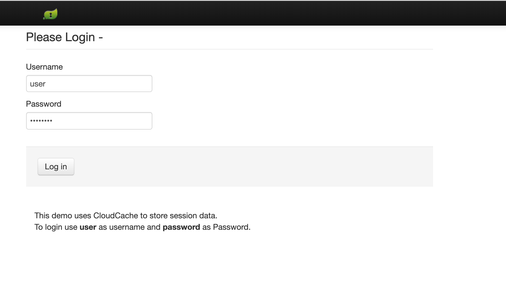
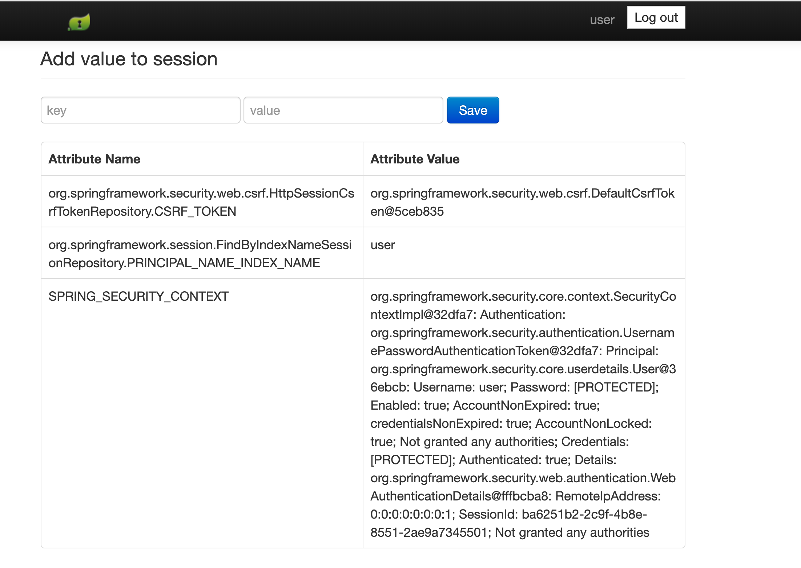

<!--
Copyright 2019 - 2021 VMware, Inc.
SPDX-License-Identifier: Apache-2.0
-->

# Spring Session Sample Boot JSON

The projects in this directory illustrate a standard Spring Boot application using Spring Session to save session data
with either Redis or Tanzu GemFire/ Apache Geode. In this example, the Redis version serialized the session data to JSON format before
storing it in the cache. In this guide, we will highlight the changes necessary for switching from Redis to Tanzu GemFire / Apache Geode
for session state caching utilizing the
[Spring Boot for Apache Geode](https://docs.spring.io/autorepo/docs/spring-boot-data-geode-build/current/reference/html5/#introduction) Spring dependency.

## How to Convert from Redis to Tanzu GemFire

### Update `build.gradle`
The Spring Boot Redis dependencies need to be updated to use Spring Boot for Apache Geode.

Remove these dependencies:


```groovy
implementation 'org.springframework.boot:spring-boot-starter-data-redis'
implementation 'org.springframework.session:spring-session-data-redis'
```

Replace them with these dependencies:

```groovy
ext {
    set('springGeodeVersion', "1.4.0")
}

dependencies {
    implementation 'org.springframework.geode:spring-geode-starter'
    implementation 'org.springframework.geode:spring-geode-starter-session'
}

dependencyManagement {
    imports {
        mavenBom "org.springframework.geode:spring-geode-bom:${springGeodeVersion}"
    }
}
```

### Add `@EnableClusterAware`
In your main application or config class (in this example `Application.java`), import and add the `@EnableClusterAware` 
annotation:

```java
import org.springframework.geode.config.annotation.EnableClusterAware;

@SpringBootApplication
@EnableClusterAware
public class Application {

	public static void main(String[] args) {
		SpringApplication.run(Application.class, args);
	}

}
```

### Remove Redis Bean from `WebMvcConfig`
This example needed the following Bean to use Redis on the Tanzu Application Service. You can remove this bean and its imports
if your app is currently using it for Redis. It is not needed for Tanzu GemFire.

```java
@Bean
public static ConfigureRedisAction configureRedisAction() {
    return ConfigureRedisAction.NO_OP;
}
```

### Remove the `SessionConfig` Class
For Redis, it is sometimes necessary to provide a specific serializer to control how data is stored on the server. This
is not necessary for Tanzu GemFire, which by default provides the [PDX Serializer](https://gemfire.docs.pivotal.io/99/geode/developing/data_serialization/gemfire_pdx_serialization.html).
Therefore the SessionConfig class is no longer needed and should be removed.

### Optional/Housekeeping
For most projects, the following changes will not be necessary, but in this example the Tanzu GemFire application is a
separate, self-contained project and these tweaks were needed:

- In `settings.gradle`, update the `rootProject.name` from `bootjson.session.redis` to `bootjson.session.gemfire`.
- In `manifest.yml`, update the JAR name in `path` from `bootjson.session.redis` to `bootjson.session.gemfire-0.0.1-SNAPSHOT.jar`.

## Running the Tanzu GemFire Application

Navigate to the Tanzu GemFire application directory and execute the following command:
```bash
./gradlew bootRun
```

Go to localhost:8080 in your browser of choice. You should see a login screen like the following:


If you haven't changed the password or user, you can login with the username of `user` and password of `password`.

Once you've logged in successfully, you should see a page similar to the following:


You can use the form to add attributes to the session. You should be able to refresh the page or close the tab
and open a new one, but when you navigate back to the application you will still be logged in, and the attributes will
still be present.

**Note:** When running these examples on the Tanzu Application Service, you will need to update the manifest.yml file to bind to your
Redis or Tanzu GemFire service instance.

## Notes on Testing
For these applications, the intention was to demonstrate how to migrate from Redis to Tanzu GemFire.  If your tests are 
not specific to either framework, they should still pass once you've migrated.