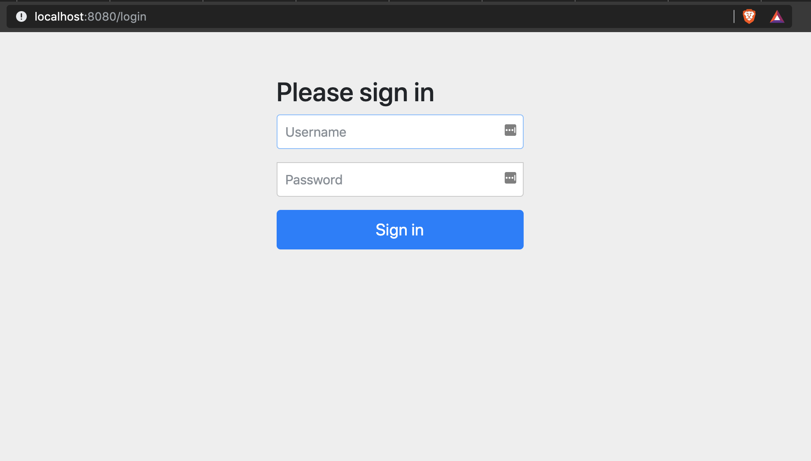
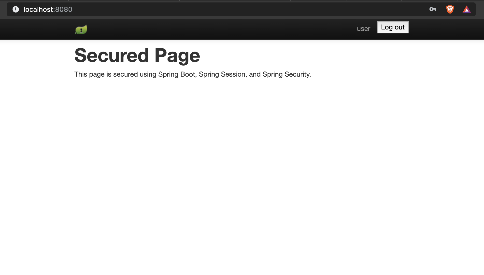

<!--Copyright (C) 2019-Present Pivotal Software, Inc. All rights reserved.

This program and the accompanying materials are made available under the terms of the under the Apache License, Version
2.0 (the "License”); you may not use this file except in compliance with the License. You may obtain a copy of the
License at

http://www.apache.org/licenses/LICENSE-2.0

Unless required by applicable law or agreed to in writing, software distributed under the License is distributed on an
"AS IS" BASIS, WITHOUT WARRANTIES OR CONDITIONS OF ANY KIND, either express or implied. See the License for the specific
language governing permissions and limitations under the License.-->

# Spring Session Sample Boot

The projects in this directory illustrate a standard Spring Boot application using Spring Session to save session data
with either Redis or Tanzu GemFire / Apache Geode. In this guide, we will highlight the changes necessary for switching from Redis to
Tanzu GemFire for session state caching utilizing the
[Spring Boot for Apache Geode](https://docs.spring.io/autorepo/docs/spring-boot-data-geode-build/current/reference/html5/#introduction) dependency.

## How to Convert from Redis to Tanzu GemFire

### Update `build.gradle`
The Spring Boot Redis dependencies need to be updated to use Spring Boot for Apache Geode.

Remove these dependencies:

```groovy
implementation 'org.springframework.boot:spring-boot-starter-data-redis'
implementation 'org.springframework.session:spring-session-data-redis'
```

Replace them with these dependencies:

```groovy
ext {
    set('springGeodeVersion', "1.4.0")
}

dependencies {
    implementation 'org.springframework.geode:spring-geode-starter'
    implementation 'org.springframework.geode:spring-geode-starter-session'
 ...
}

dependencyManagement {
    imports {
        mavenBom "org.springframework.geode:spring-geode-bom:${springGeodeVersion}"
    }
}
```

### Add `@EnableClusterAware`
In your main application or config class (in this example `Application.java`), import and add the `@EnableClusterAware` 
annotation:

```java
import org.springframework.geode.config.annotation.EnableClusterAware;

@SpringBootApplication
@EnableClusterAware
public class Application {

	public static void main(String[] args) {
		SpringApplication.run(Application.class, args);
	}

}
```

### Remove Redis Bean from `WebMvcConfig`
This example needed the following Bean to use Redis on the Tanzu Application Service. You can remove this bean and its imports
if your app is currently using it for Redis. It is not needed for GemFire.

```java
@Bean
public static ConfigureRedisAction configureRedisAction() {
    return ConfigureRedisAction.NO_OP;
}
```

### Optional/Housekeeping
For most projects, the following changes will not be necessary, but in this example the GemFire application is a
separate, self-contained project and these tweaks were needed:

- In `settings.gradle`, update the `rootProject.name` from `boot.session.redis` to `boot.session.gemfire`.
- In `manifest.yml`, update the JAR name in `path` from `boot.session.redis` to `boot.session.gemfire-0.0.1-SNAPSHOT.jar`.

## Running the Tanzu GemFire Application

Navigate to the GemFire application directory and execute the following command:
```bash
./gradlew bootRun
```

Go to localhost:8080 in your browser of choice. You should see a login screen like the following:


If you haven't changed the password or user, you can login with the username of `user` and password of `password`.

Once you've logged in successfully, you should see a page similar to the following:


You should be able to refresh the page or close the tab and open a new one, but when you navigate back to the
application you will still be logged in.

**Note:** When running these examples on the Tanzu Application Service, you will need to update the manifest.yml file to bind to your
Redis or Tanzu GemFire service instance.

## Notes on Testing
For these applications, the intention was to demonstrate how to migrate from Redis to Tanzu GemFire.  If your tests are 
not specific to either framework, they should still pass once you've migrated.